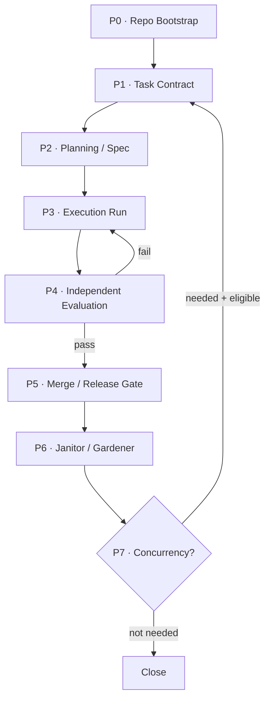

# V3.1 — Layered Agent Engineering Standard

A production-ready engineering standard for AI-agent-driven software development. Define layered structure, enforce evidence-based completion, and scale from single-agent execution to coordinated swarms — without losing control.

## Why

Most AI coding setups fail for the same reasons:

- **No separation of concerns.** Planning, building, and evaluation blur together. The agent self-approves and moves on.
- **No evidence of completion.** "It looks fine" replaces test results, proof-of-work, and acceptance criteria.
- **Premature parallelism.** Multiple agents start before single-agent execution is stable, creating coordination overhead that exceeds throughput gains.
- **Knowledge lives in chat.** Architecture decisions, glossaries, and constraints exist only in conversation history — invisible to the next session.

V3.1 solves these by separating **what the system is made of** (five layers) from **how it runs** (an eight-phase state machine), with assurance cutting across everything.

## How It Works

```
Five-Layer Structure          Eight-Phase State Machine
─────────────────────         ──────────────────────────
L1  Context Infrastructure    P0  Repo Bootstrap
L2  Execution Harness         P1  Task Contract
L3  Coordination Harness      P2  Planning / Spec
L4  Control Plane             P3  Execution Run
L5  Assurance Plane (cross)   P4  Independent Evaluation
                              P5  Merge / Release Gate
                              P6  Janitor / Gardener
                              P7  Concurrency Expansion
```



## Core Principles

| # | Principle | Implication |
|---|-----------|-------------|
| 1 | **Repo is the single source of truth** | If the agent can't see it in the repo, it doesn't exist |
| 2 | **Constraints over reminders** | Encode rules in linters, schemas, CI gates — not "please be careful" |
| 3 | **Completion is defined by evidence** | Tests, PoW, evaluator verdicts — not self-reported status |
| 4 | **Complexity must be provable** | Every harness component encodes a hypothesis about model limitations |
| 5 | **Concurrency is not the default** | Start with 1 planner + 1 builder + 1 evaluator. Scale only when stable |

## Quick Start

### Option A: Bootstrap a new project

```bash
# Clone the standard
git clone https://github.com/qiuranke99/v3-agent-standard.git

# Run the bootstrap script to scaffold a new project
./v3-agent-standard/scripts/bootstrap.sh my-project

# Your project is ready with the full V3.1 directory structure
cd my-project && tree -L 2
```

### Option B: Use with a coding agent

Point your coding agent (Claude Code, Gemini CLI, Cursor, Codex, etc.) at the standard:

```
Read STANDARD.md and bootstrap this project according to V3.1.
```

### Option C: Use the templates directly

Copy files from `templates/` into your project:

```bash
cp templates/AGENTS.md my-project/
cp templates/WORKFLOW.md my-project/
cp templates/TASK_CONTRACT.md my-project/tasks/active/
```

## Project Structure

```
v3-agent-standard/
├── STANDARD.md              # The complete V3.1 specification (source of truth)
├── README.md                # This file
├── LICENSE                  # MIT license
│
├── templates/               # Drop-in templates for any project
│   ├── AGENTS.md            # Agent behavior rules & navigation map
│   ├── WORKFLOW.md          # State machine, retry policy, run lifecycle
│   ├── TASK_CONTRACT.md     # Goal, scope, non-goals, acceptance criteria
│   ├── HANDOFF.md           # What was done, what remains, evidence
│   ├── PROOF_OF_WORK.md     # Build/test/acceptance evidence for merge
│   ├── SPEC.md              # Planner output: deliverables, chunks, risks
│   └── SPRINT_PLAN.md       # Chunk breakdown with ordering & dependencies
│
├── scripts/                 # Automation
│   └── bootstrap.sh         # Scaffold a new V3.1-compliant project
│
└── examples/                # Reference implementations
    └── minimal-project/     # A barebones V3.1-compliant project skeleton
```

## Five-Layer Structure

### L1 — Context Infrastructure
Make all knowledge repo-visible: `AGENTS.md`, `ARCHITECTURE.md`, `GLOSSARY.md`, `docs/specs/`, `docs/contracts/`. A new agent entering the project can recover full context from the repo alone.

### L2 — Execution Harness
Planner → Builder → Evaluator triangle. Task contracts define scope. Sprint plans break work into chunks. Handoffs carry evidence between phases. Builder never self-approves.

### L3 — Coordination Harness
Only activate when single-agent execution is stable. Isolated workspaces, upward-only handoff, no shared mutable state. Workers don't talk to each other.

### L4 — Control Plane
Ticket-driven execution with `WORKFLOW.md` defining the state machine, retry policy, max turns, and merge/close conditions. Runs are versioned and reproducible.

### L5 — Assurance Plane (cross-cutting)
Evidence system spanning all layers: lint, type checks, tests, proof-of-work, green branch policy, rollback conditions. "Looks fine" is not evidence.

## Role Separation

| Role | Does | Does NOT |
|------|------|----------|
| **Planner** | Expand spec, split sprints, flag risks | Write implementation code |
| **Builder** | Implement per contract, update docs, produce handoff | Self-approve, expand scope |
| **Evaluator** | Independent verification with hard thresholds | Repeat builder's self-report |
| **Janitor** | Clean dead code, fix AI slop, promote rules | Add new features |
| **Human** | Define requirements, approve releases, override risk | Micromanage execution |

## Escalation Conditions

The agent operates autonomously **unless** one of these conditions triggers:

1. Requirements or scope conflict that cannot be resolved from the contract
2. Acceptance / release decision that requires human judgment
3. Spec fundamentally conflicts with architecture
4. High-risk override, irreversible operation, or boundary-exceeding tradeoff
5. Evaluator fails repeatedly and root cause is not in implementation layer

## Design Philosophy

This standard synthesizes ideas from:

- **OpenAI** — Harness engineering, repo as system of record
- **Anthropic** — Planner-generator-evaluator, sprint contracts
- **Cursor** — Recursive planner-worker, constraints > instructions
- **Symphony** — Ticket → workspace → run → proof-of-work → PR
- **Internal V2 workflow** — Phase 0–N, swarm, issue loop, harness iteration

The key insight: **layers define what the system is made of; the state machine defines how it runs.** This decoupling is what makes V3.1 more stable than frameworks that conflate structure with process.

## Contributing

Issues and PRs welcome. If you adapt V3.1 for your own workflow, share what worked.

## License

[MIT](LICENSE)
