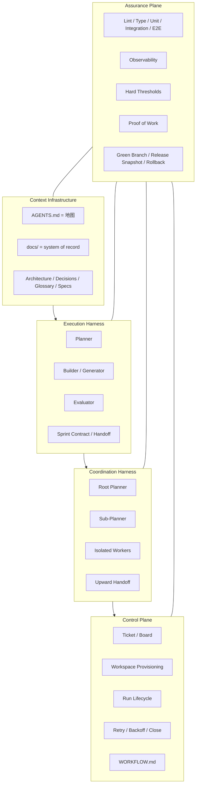
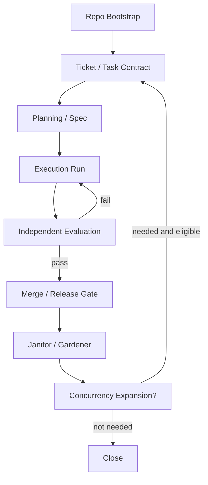

# V3.1 — Layered Agent Engineering Standard

## 文档定位

本文档是一套可直接应用到**新项目开发**中的统一标准，用于整合：

- Harness Engineering
- Planner / Builder / Evaluator
- Agent Swarm / Sub-Agent Swarm
- Ticket → Workspace → Run → PR
- Proof of Work / 验收 / 发布门禁
- V3 流程化执行

本文档解决两个长期问题：

1. **只讲 phase，不讲层级边界**，会导致 harness、swarm、workflow、eval 混在一起。
2. **只讲五层结构，不讲流程状态机**，会停留在概念层，无法落地。

因此，V3.1 的原则是：

> **五层结构定义系统由什么组成。**  
> **V3 流程化定义系统如何运行。**

这比单独使用 V2、单独使用 phase 文档、或单独使用五层抽象都更稳定。

---

# Part I — Core Principles

## 1. 基本原则

### 1.1 Repo 是唯一事实源

对 agent 来说，看不到的知识等于不存在。  
需求、术语、架构、约束、当前计划、验收规则、handoff、proof-of-work、release decision，都必须进入 repo，且可版本化、可引用、可校验。

### 1.2 约束优于提醒

"请小心""请尽量遵守"这类软提示不能当工程机制。  
应将规则写进：

- linter
- formatter
- schema
- CI gate
- type check
- test
- workflow state machine
- release gate

### 1.3 完成必须由证据定义

不能依赖 builder 的自我判断宣布"完成"。  
完成必须由以下证据组成：

- 测试结果
- 运行结果
- 可观测性信号
- proof-of-work
- evaluator 判定
- reviewer / human sign-off（按风险等级）

### 1.4 复杂度必须可证明

Harness 中的每个组件，本质上都在编码一个关于"当前模型还做不到什么"的假设。  
因此：

- 复杂度只在可证明必要时增加
- 模型升级后，旧 harness 组件要重新验证
- 无法证明仍然 load-bearing 的组件，应删除

### 1.5 并发不是默认值

Swarm 不是默认开局方式。  
默认开局方式应该是：

- 单 planner
- 单 builder
- 单 evaluator

只有当单 agent execution 稳定、assurance 成熟、repo 模块化程度足够高时，才引入 sub-agent swarm。

---

# Part II — Five-Layer Structure

## 2. 五层结构总览

V3.1 采用以下五层结构：

1. **Context Infrastructure**  
2. **Execution Harness**  
3. **Coordination Harness**  
4. **Control Plane**  
5. **Assurance Plane**（横切所有层）

## 2.1 分层示意图



---

## 3. Layer 1 — Context Infrastructure

### 3.1 目标

让 agent 拿到稳定、结构化、可恢复、可验证的上下文。

### 3.2 必备工件

- `AGENTS.md`
- `README.md`
- `ARCHITECTURE.md`
- `DECISIONS.md`
- `GLOSSARY.md`
- `docs/specs/`
- `docs/contracts/`
- `docs/acceptance/`
- `docs/rubrics/`
- `docs/runbooks/`

### 3.3 AGENTS.md 的角色

`AGENTS.md` 只做三件事：

1. 说明 agent 在此 repo 中的基本行为规则  
2. 指向更深层的上下文文档  
3. 告诉 agent 先看什么，后看什么  

它**不是**百科全书，不应该承载所有规则和背景。

### 3.4 禁止项

- 巨型 instruction file
- 关键知识只存在聊天记录中
- 架构原则只存在人脑里
- 没有 glossary 导致术语漂移
- 当前计划只存在某次临时会话里

### 3.5 Entry Criteria

- repo 已初始化
- `AGENTS.md` 已存在
- `docs/` 基本目录存在
- `ARCHITECTURE.md` 和 `README.md` 已创建

### 3.6 Exit Criteria

- 新 agent 进入项目后，可通过 repo 恢复关键上下文
- 关键概念均可在 repo 内被定位
- 术语、边界、计划、规则有版本记录
- 关键文档能互相引用，不是散落的孤岛

---

## 4. Layer 2 — Execution Harness

### 4.1 目标

让单次任务在几十分钟到数小时内保持方向和质量，不被以下问题破坏：

- coherence drift
- context pressure
- self-evaluation bias
- scope expansion
- incomplete finish

### 4.2 默认角色

- **Planner**
- **Builder / Generator**
- **Evaluator**

### 4.3 核心机制

- spec 扩写
- sprint / chunk 切分
- task contract
- handoff artifact
- evaluator 独立验证
- context compaction / reset 策略
- 失败重试与回退点

### 4.4 默认执行模式

#### 模式 A：短任务执行
适用于：

- 局部修复
- 单模块小功能
- 文档更新
- test 补齐

流程：

1. planner 快速定义 scope
2. builder 实现
3. evaluator 验收
4. 进入 merge gate

#### 模式 B：长任务执行
适用于：

- 新功能落地
- 多模块重构
- 协议改造
- 长会话运行

流程：

1. planner 产出 spec
2. builder 按 sprint / chunk 执行
3. 每个 chunk 输出 handoff
4. evaluator 基于 contract 验收
5. 不通过则回 builder 重做
6. 通过则进入下一个 chunk

### 4.5 禁止项

- builder 自己宣布任务完成
- 不写 contract 直接开做
- 无上限地扩大单次任务范围
- evaluator 和 builder 共用同一判断逻辑
- 没有明确失败回退点

### 4.6 Entry Criteria

- task 已压缩成明确 ticket / contract
- 验收目标可以写成 checklist / thresholds
- 必要上下文在 repo 内可得
- 风险等级已标注

### 4.7 Exit Criteria

- builder 交出 `HANDOFF.md`
- evaluator 给出 pass / fail
- 所需证据已产出
- 失败时可定位回退点

---

## 5. Layer 3 — Coordination Harness

### 5.1 目标

在并行 agent 存在时，降低协调成本和同步失败风险。

### 5.2 默认结构

- root planner
- sub-planner（可选）
- isolated worker
- upward handoff only

### 5.3 核心机制

- 独立 workspace / worktree
- 任务分区
- 向上 handoff
- 减少横向通信
- 不引入全局共享状态作为主协调机制
- 不引入中心 integrator 作为唯一合流点

### 5.4 适用条件

仅在满足以下全部条件时启用：

- repo 已按模块边界拆分
- 单 agent execution 已稳定
- handoff 模板成熟
- assurance 已能覆盖并发变更
- 构建系统不会因增加 worker 立即失控

### 5.5 禁止项

- worker 共享一个 `progress.md` 作为唯一协调源
- worker 之间频繁直接协商
- 全员写同一份共享文件
- central integrator 审一切
- monolith 未拆分就直接扩大并发

### 5.6 Entry Criteria

- 模块边界清楚
- 任务天然可分区
- handoff 规范可复用
- evaluator 能覆盖并发结果

### 5.7 Exit Criteria

- 并发增加带来净吞吐提升
- planner 能通过 handoff 稳定收敛
- 没有因为协调机制造成系统性等待

---

## 6. Layer 4 — Control Plane

### 6.1 目标

把"人逐个触发 agent"升级为"票据驱动 + 工作区驱动 + run lifecycle 驱动"的执行系统。

### 6.2 核心机制

- Ticket / Board / Queue
- Workspace Provisioning
- Run Lifecycle
- Retry / Backoff
- PR Creation / Closure
- Handoff / Close
- `WORKFLOW.md`

### 6.3 WORKFLOW.md 的角色

`WORKFLOW.md` 负责版本化：

- 并发数
- 轮次上限
- 状态机
- 重试策略
- close / merge 规则
- agent 行为模板

### 6.4 禁止项

- workflow 行为只写在 prompt 里
- 每次 run 靠人工拼接上下文
- 没有状态机
- 没有 workspace 生命周期
- run 失败后无重试 / 终止 / 恢复策略

### 6.5 Entry Criteria

- ticket 粒度明确
- execution harness 稳定
- workspace 初始化脚本可用
- PR / handoff 规范已存在

### 6.6 Exit Criteria

- ticket 可驱动 run
- run 可被重试、关闭、恢复
- workflow 行为已版本化
- PR / close / rework 路径明确

---

## 7. Layer 5 — Assurance Plane（横切）

### 7.1 目标

定义"完成"的证据体系。

### 7.2 Assurance 的对象

Assurance 不属于某一步骤，而是贯穿所有层。  
它覆盖：

- Context correctness
- Execution correctness
- Coordination safety
- Control reliability
- Release confidence

### 7.3 默认组成

- lint
- formatter
- type check
- unit test
- integration test
- e2e test
- schema validation
- observability check
- proof-of-work
- green branch
- release snapshot
- rollback condition

### 7.4 Proof of Work 的角色

Proof of Work 是 Assurance Plane 的关键产物。  
每个需要 merge 的任务，都应具备最小 PoW，包括：

- build status
- test status
- acceptance checklist
- evidence links
- known limitation
- merge recommendation

### 7.5 禁止项

- "看起来可以"
- "本地跑了一次"
- "builder 说没问题"
- 无证据自动合并
- evaluator 没有硬阈值

### 7.6 Entry Criteria

- 至少有基础 CI / test / evaluator 可运行
- 每种任务类型有最低验收规则
- 关键路径有基本观察信号

### 7.7 Exit Criteria

- merge / release 都可被证据回溯
- green branch 可复现
- rollback 条件明确
- 完成不再依赖口头判断

---

# Part III — V3 Processization

## 8. V3 流程化总览

V3.1 将流程定义为以下状态机：

- **P0 — Repo Bootstrap**
- **P1 — Ticket / Task Contract**
- **P2 — Planning / Spec**
- **P3 — Execution Run**
- **P4 — Independent Evaluation**
- **P5 — Merge / Release Gate**
- **P6 — Janitor / Gardener**
- **P7 — Concurrency Expansion（可选）**

## 8.1 流程总图



---

## 9. Phase P0 — Repo Bootstrap

### 9.1 目标

建立最小可运行的 Context Infrastructure 与 Assurance 基线。

### 9.2 必做项

- 创建 repo
- 建立目录结构
- 创建 `AGENTS.md`
- 创建 `README.md`
- 创建 `ARCHITECTURE.md`
- 创建 `DECISIONS.md`
- 创建 `docs/` 子目录
- 建立最小 CI
- 配置 lint / formatter / type check
- 建立 `WORKFLOW.md`
- 建立 `Task Contract`、`Handoff`、`PoW` 模板

### 9.3 Exit Criteria

- 新 agent 可进入项目并恢复上下文
- 基础 assurance 工具能跑通
- workflow 有默认状态机
- 所有模板已存在

---

## 10. Phase P1 — Ticket / Task Contract

### 10.1 目标

把需求压缩成一张真正可执行的任务单。

### 10.2 输入

- 用户需求
- 当前项目上下文
- 架构边界
- 已知约束

### 10.3 输出

`TASK_CONTRACT.md`

### 10.4 标准结构

```md
# Task Contract

## Goal
本任务要达成什么结果？

## Scope
这次包含什么？

## Non-Goals
这次明确不做什么？

## Risks
当前最大风险是什么？

## Dependencies
依赖哪些已有模块或外部条件？

## Acceptance
完成的硬标准是什么？

## Required Proof
必须交付哪些证据？

## Rollback Condition
什么情况下要回退？
```

### 10.5 Exit Criteria

- 目标明确
- 边界明确
- 不做什么明确
- 验收标准是硬标准
- 风险已标注

---

## 11. Phase P2 — Planning / Spec

### 11.1 目标

由 planner 扩写 spec，但不进入实现。

### 11.2 输出物

- `SPEC.md`
- `SPRINT_PLAN.md`
- `RISKS.md`

### 11.3 Planner 规则

planner 只负责：

- 扩 scope
- 明确 deliverables
- 识别风险
- 设计 chunk / sprint
- 指出 evaluator 如何验证

planner 不负责：

- 写最终实现代码
- 替 builder 决定低层技术细节
- 在 spec 中塞入过量实现细节

### 11.4 Exit Criteria

- spec 清楚
- sprint / chunk 拆分合理
- 评估标准清楚
- 风险与回退点已写明

---

## 12. Phase P3 — Execution Run

### 12.1 目标

builder 按 chunk / sprint 执行任务，并产出 handoff。

### 12.2 输入

- `TASK_CONTRACT.md`
- `SPEC.md`
- `SPRINT_PLAN.md`
- 当前代码与 docs

### 12.3 输出

- 代码变更
- 测试变更
- 文档变更
- `HANDOFF.md`

### 12.4 Handoff 模板

```md
# Handoff

## What was done
做了什么？

## What remains
还剩什么？

## Known risks
还存在什么风险？

## Evidence produced
产出了什么证据？

## Suggested next step
下一步建议是什么？
```

### 12.5 Builder 规则

builder 必须：

- 严格按 contract 和 spec 工作
- 只处理当前 chunk
- 每次提交都可恢复
- 更新必要文档
- 输出 handoff

builder 禁止：

- 擅自扩 scope
- 把 evaluator 职责吞进去
- 无法恢复的脏提交
- 只改代码不改上下文文档

### 12.6 Exit Criteria

- handoff 完整
- 代码可运行
- 文档同步
- 必要测试已补充

---

## 13. Phase P4 — Independent Evaluation

### 13.1 目标

让 evaluator 独立验证结果，不信 builder 自述。

### 13.2 输入

- `TASK_CONTRACT.md`
- `SPEC.md`
- `HANDOFF.md`
- 可运行应用 / 模块
- CI / logs / traces / screenshots

### 13.3 输出

- pass / fail
- bug list
- missing proof list
- rework suggestion

### 13.4 Evaluator 规则

evaluator 必须：

- 依据 contract 验证
- 依据 PoW 验证
- 尝试真实运行
- 使用硬阈值
- 给出结构化失败原因

evaluator 禁止：

- 重复 builder 的自我说明
- 用模糊语句代替结论
- 无证据通过
- 不可复现的验收结论

### 13.5 Exit Criteria

- 有明确 pass / fail
- 失败项可回 builder 重做
- 通过项有证据支持
- 不存在模糊的"差不多完成"

---

## 14. Phase P5 — Merge / Release Gate

### 14.1 目标

通过 Assurance Plane 决定是否允许进入主干或发布。

### 14.2 必过项

- lint 绿
- type check 绿
- tests 绿
- acceptance checklist 通过
- PoW 完整
- reviewer / human sign-off 满足策略
- snapshot 已生成（如需要）

### 14.3 PoW 模板

```md
# Proof of Work

## Build status
## Test status
## Demo / screenshots / traces
## Acceptance checklist
## Known limitations
## Merge recommendation
```

### 14.4 Exit Criteria

- 主干可保持绿色
- merge 决策可回溯
- release decision 有依据
- rollback 条件明确

---

## 15. Phase P6 — Janitor / Gardener

### 15.1 目标

持续抑制熵增，防止 AI slop 累积。

### 15.2 Janitor 负责

- 清理死代码
- 清理未使用 import
- 清理重复逻辑
- 清理过时文档
- 清理坏模式扩散
- 推动规则升级（rule promotion）

### 15.3 Gardener 负责

- 更新 docs 索引
- 修复过期说明
- 修复术语漂移
- 维护 runbooks
- 将 review 评论升格为规则 / rubric

### 15.4 Exit Criteria

- 明显 AI slop 已清理
- 文档新鲜度达标
- review 中重复出现的问题已被规则化

---

## 16. Phase P7 — Concurrency Expansion（可选）

### 16.1 目标

只在条件成熟时引入 sub-agent swarm。

### 16.2 前置条件

必须全部满足：

- 单 builder / evaluator 流程稳定
- repo 已模块化
- handoff 模板成熟
- assurance 已足够强
- control plane 已可追踪 run lifecycle

### 16.3 默认并发策略

#### Level 0
- 1 planner
- 1 builder
- 1 evaluator

#### Level 1
- 1 planner
- 2 workers
- 1 evaluator

#### Level 2
- 1 root planner
- N sub-planners
- M isolated workers
- centralized evaluator policy
- no centralized integrator

### 16.4 禁止项

- 在 monolith 下盲目加 worker
- 未有 assurance 就上 swarm
- worker 横向频繁交流
- 所有 worker 写同一共享文件

### 16.5 Exit Criteria

- 并发提升带来净吞吐提升
- handoff 负担不压垮 planner
- evaluator 能持续覆盖并发变更

---

# Part IV — Repository Standard

## 17. 最小目录标准

```text
project/
├── AGENTS.md
├── WORKFLOW.md
├── README.md
├── ARCHITECTURE.md
├── DECISIONS.md
├── GLOSSARY.md
├── docs/
│   ├── specs/
│   ├── contracts/
│   ├── acceptance/
│   ├── rubrics/
│   ├── runbooks/
│   └── changelogs/
├── tasks/
│   ├── active/
│   ├── done/
│   └── rejected/
├── evidence/
│   ├── screenshots/
│   ├── logs/
│   ├── traces/
│   └── reports/
├── scripts/
│   ├── bootstrap.sh
│   ├── run_eval.sh
│   ├── make_pow.sh
│   ├── janitor.sh
│   └── release_snapshot.sh
├── .ci/
└── src/
```

---

## 18. WORKFLOW.md 最小标准

`WORKFLOW.md` 至少应定义：

- tracker 来源
- workspace 根目录
- after_create 初始化动作
- 最大并发数
- 最大连续轮次
- 状态机
- 重试规则
- merge / close / rework 条件

### 最小示例

```md
---
tracker:
  kind: local
workspace:
  root: ./workspaces
agent:
  max_concurrent_agents: 2
  max_turns: 12
states:
  - todo
  - in_progress
  - human_review
  - rework
  - merged
  - closed
retry:
  max_attempts: 2
---

You are working on ticket {{ ticket.id }}.

Follow:
1. Read AGENTS.md
2. Read the linked contract/spec
3. Execute only the current task
4. Produce HANDOFF.md
5. Produce Proof of Work
6. Stop if evidence is insufficient
```

---

# Part V — Governance

## 19. 决策权归属

### 19.1 Human 的职责

Human 负责：

- 需求定义
- scope 边界
- 战略取舍
- 最终 release 决策
- 高风险 override

### 19.2 Planner 的职责

Planner 负责：

- 扩写 spec
- 切 chunk / sprint
- 明确 deliverables
- 标注风险

### 19.3 Builder 的职责

Builder 负责：

- 实现
- 补测试
- 更新 docs
- 输出 handoff

### 19.4 Evaluator 的职责

Evaluator 负责：

- 独立验证
- 明确 pass/fail
- 输出 bug list
- 说明缺失证据

### 19.5 Janitor / Gardener 的职责

负责：

- 熵管理
- 文档新鲜度
- 规则升级
- 坏模式清理

---

## 20. 升级与回退规则

### 20.1 从 builder 升级到 human 的条件

- contract 不清楚
- acceptance 有冲突
- spec 与架构冲突
- evaluator 反复失败但根因不是实现层

### 20.2 从短任务回退到 planning 的条件

- scope 扩张
- chunk 无法被当前 contract 约束
- builder 需要大规模跨模块改造
- evaluator 指出缺失的是 spec，而不是代码

### 20.3 从并发回退到单 agent 的条件

- 协调成本高于吞吐收益
- handoff 开始失真
- 构建 / IO / merge 冲突恶化
- assurance 覆盖不住并发变化

---

# Part VI — Why V3.1 Is Better Than V2

## 21. V2 的优点

你现有的 V2 已经做对了很多事：

- 有 phase 意识
- 有 swarm 角色意识
- 有 harness 先行意识
- 有 issue loop
- 有 progress / handoff / janitor 的雏形

这些都说明方向是对的。

## 22. V2 的核心问题

### 22.1 把 Harness 过度理解为 Phase 0

这容易让团队误解为：

- harness 是前置工程
- 只搭一次
- 后面主要是执行

但现实里 harness 会持续进入：

- docs
- lint
- rules
- workflow
- proof-of-work
- janitor
- observability

的系统。

### 22.2 没把 Assurance 单独升格为横切平面

V2 里验证更像 phase 的一部分；  
V3.1 里，Assurance 是穿透所有层的证据系统。  
这是关键差异。

### 22.3 过早把 swarm 默认化

V2 会让人自然走向：

- 一开始就上 swarm
- progress.md 当共享记忆
- phase 中默认多角色并行

这是高风险默认值。

## 23. V3.1 的改进总结

V3.1 相比 V2 的进步在于：

- 把"层"和"流程"解耦
- 把 assurance 升格为横切面
- 把 control plane 单独抽出来
- 把 swarm 改成条件升级方案
- 把 repo legibility、PoW、janitor、workflow 统一为一个工程体系

---

# Part VII — Minimal Templates

## 24. Template — AGENTS.md

```md
# AGENTS.md

## First Read
1. README.md
2. ARCHITECTURE.md
3. GLOSSARY.md
4. docs/contracts/
5. docs/specs/

## Role Rules
- Follow the current Task Contract only
- Do not expand scope without updating the contract
- Always update docs when changing architecture or behavior
- Always produce HANDOFF.md for non-trivial work
- Never declare completion without required proof

## Where to Find Things
- Specs: docs/specs/
- Contracts: docs/contracts/
- Acceptance: docs/acceptance/
- Rubrics: docs/rubrics/
- Runbooks: docs/runbooks/

## Non-Negotiables
- Lint/type/tests must stay green
- Builder cannot self-approve
- Evaluator must use evidence
- Release requires Proof of Work
```

---

## 25. Template — Task Contract

```md
# Task Contract

## Ticket ID
## Goal
## Scope
## Non-Goals
## Risks
## Dependencies
## Acceptance
## Required Proof
## Rollback Condition
## Owner
## Status
```

---

## 26. Template — Handoff

```md
# Handoff

## What was done
## What remains
## Known risks
## Evidence produced
## Suggested next step
## Blocking items
```

---

## 27. Template — Proof of Work

```md
# Proof of Work

## Build status
## Type check status
## Test status
## Acceptance checklist
## Demo evidence
## Logs / traces
## Known limitations
## Merge recommendation
```

---

# Part VIII — Final Rule

## 28. 最终规则

将 V3.1 压缩成一句话：

> **先建 Context，再跑 Execution；Execution 稳了再谈 Coordination；Control Plane 负责调度；Assurance 永远凌驾于所有层之上。**

这就是 V3.1 的核心。

---
