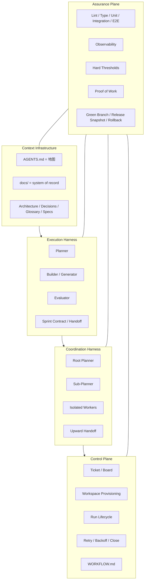
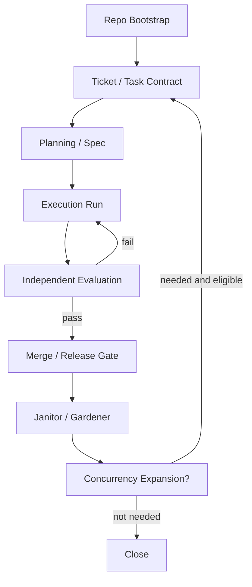

# V3.1 — Layered Agent Engineering Standard

## 文档定位

本文档是一套可直接应用到**新项目开发**中的统一标准，用于整合：

- Harness Engineering
- Planner / Builder / Evaluator
- Agent Swarm / Sub-Agent Swarm
- Ticket → Workspace → Run → PR
- Proof of Work / 验收 / 发布门禁
- V3 流程化执行

本文档解决两个长期问题：

1. **只讲 phase，不讲层级边界**，会导致 harness、swarm、workflow、eval 混在一起。
2. **只讲五层结构，不讲流程状态机**，会停留在概念层，无法落地。

因此，V3.1 的原则是：

> **五层结构定义系统由什么组成。**  
> **V3 流程化定义系统如何运行。**

这比单独使用 V2、单独使用 phase 文档、或单独使用五层抽象都更稳定。

---

# Part I — Core Principles

## 1. 基本原则

### 1.1 Repo 是唯一事实源

对 agent 来说，看不到的知识等于不存在。  
需求、术语、架构、约束、当前计划、验收规则、handoff、proof-of-work、release decision，都必须进入 repo，且可版本化、可引用、可校验。

### 1.2 约束优于提醒

"请小心""请尽量遵守"这类软提示不能当工程机制。  
应将规则写进：

- linter
- formatter
- schema
- CI gate
- type check
- test
- workflow state machine
- release gate

### 1.3 完成必须由证据定义

不能依赖 builder 的自我判断宣布"完成"。  
完成必须由以下证据组成：

- 测试结果
- 运行结果
- 可观测性信号
- proof-of-work
- evaluator 判定
- reviewer / human sign-off（按风险等级）

### 1.4 复杂度必须可证明

Harness 中的每个组件，本质上都在编码一个关于"当前模型还做不到什么"的假设。  
因此：

- 复杂度只在可证明必要时增加
- 模型升级后，旧 harness 组件要重新验证
- 无法证明仍然 load-bearing 的组件，应删除

### 1.5 并发不是默认值

Swarm 不是默认开局方式。  
默认开局方式应该是：

- 单 planner
- 单 builder
- 单 evaluator

只有当单 agent execution 稳定、assurance 成熟、repo 模块化程度足够高时，才引入 sub-agent swarm。

### 1.6 Agent 会自我欺骗

AI agent 天然倾向于走最短路径，并为跳步行为生成合理化借口。  
这种 self-rationalization 是系统性风险，不能用软提示对抗，必须用结构性机制对抗：

- **反借口表（Anti-Rationalization Table）**：在关键 phase 列出常见借口和对应的反驳
- **红旗信号（Red Flags）**：标识 phase 正在偏离的可观测信号
- **技能绑定（Skill Binding）**：每个 phase 绑定具体的执行技能，不留"自由发挥"空间

这三种机制的目标一致：

> **不信任 agent 的判断。只信任 agent 产出的证据。**

---

# Part II — Five-Layer Structure

## 2. 五层结构总览

V3.1 采用以下五层结构：

1. **Context Infrastructure**  
2. **Execution Harness**  
3. **Coordination Harness**  
4. **Control Plane**  
5. **Assurance Plane**（横切所有层）

## 2.1 分层示意图



---

## 3. Layer 1 — Context Infrastructure

### 3.1 目标

让 agent 拿到稳定、结构化、可恢复、可验证的上下文。

### 3.2 必备工件

- `AGENTS.md`
- `README.md`
- `ARCHITECTURE.md`
- `DECISIONS.md`
- `GLOSSARY.md`
- `docs/specs/`
- `docs/contracts/`
- `docs/acceptance/`
- `docs/rubrics/`
- `docs/runbooks/`

### 3.3 AGENTS.md 的角色

`AGENTS.md` 只做三件事：

1. 说明 agent 在此 repo 中的基本行为规则  
2. 指向更深层的上下文文档  
3. 告诉 agent 先看什么，后看什么  

它**不是**百科全书，不应该承载所有规则和背景。

### 3.4 禁止项

- 巨型 instruction file
- 关键知识只存在聊天记录中
- 架构原则只存在人脑里
- 没有 glossary 导致术语漂移
- 当前计划只存在某次临时会话里

### 3.5 Entry Criteria

- repo 已初始化
- `AGENTS.md` 已存在
- `docs/` 基本目录存在
- `ARCHITECTURE.md` 和 `README.md` 已创建

### 3.6 Exit Criteria

- 新 agent 进入项目后，可通过 repo 恢复关键上下文
- 关键概念均可在 repo 内被定位
- 术语、边界、计划、规则有版本记录
- 关键文档能互相引用，不是散落的孤岛

---

## 4. Layer 2 — Execution Harness

### 4.1 目标

让单次任务在几十分钟到数小时内保持方向和质量，不被以下问题破坏：

- coherence drift
- context pressure
- self-evaluation bias
- scope expansion
- incomplete finish

### 4.2 默认角色

- **Planner**
- **Builder / Generator**
- **Evaluator**

### 4.3 核心机制

- spec 扩写
- sprint / chunk 切分
- task contract
- handoff artifact
- evaluator 独立验证
- context compaction / reset 策略
- 失败重试与回退点

### 4.4 默认执行模式

#### 模式 A：短任务执行
适用于：

- 局部修复
- 单模块小功能
- 文档更新
- test 补齐

流程：

1. planner 快速定义 scope
2. builder 实现
3. evaluator 验收
4. 进入 merge gate

#### 模式 B：长任务执行
适用于：

- 新功能落地
- 多模块重构
- 协议改造
- 长会话运行

流程：

1. planner 产出 spec
2. builder 按 sprint / chunk 执行
3. 每个 chunk 输出 handoff
4. evaluator 基于 contract 验收
5. 不通过则回 builder 重做
6. 通过则进入下一个 chunk

### 4.5 禁止项

- builder 自己宣布任务完成
- 不写 contract 直接开做
- 无上限地扩大单次任务范围
- evaluator 和 builder 共用同一判断逻辑
- 没有明确失败回退点

### 4.6 Entry Criteria

- task 已压缩成明确 ticket / contract
- 验收目标可以写成 checklist / thresholds
- 必要上下文在 repo 内可得
- 风险等级已标注

### 4.7 Exit Criteria

- builder 交出 `HANDOFF.md`
- evaluator 给出 pass / fail
- 所需证据已产出
- 失败时可定位回退点

---

## 5. Layer 3 — Coordination Harness

### 5.1 目标

在并行 agent 存在时，降低协调成本和同步失败风险。

### 5.2 默认结构

- root planner
- sub-planner（可选）
- isolated worker
- upward handoff only

### 5.3 核心机制

- 独立 workspace / worktree
- 任务分区
- 向上 handoff
- 减少横向通信
- 不引入全局共享状态作为主协调机制
- 不引入中心 integrator 作为唯一合流点

### 5.4 适用条件

仅在满足以下全部条件时启用：

- repo 已按模块边界拆分
- 单 agent execution 已稳定
- handoff 模板成熟
- assurance 已能覆盖并发变更
- 构建系统不会因增加 worker 立即失控

### 5.5 禁止项

- worker 共享一个 `progress.md` 作为唯一协调源
- worker 之间频繁直接协商
- 全员写同一份共享文件
- central integrator 审一切
- monolith 未拆分就直接扩大并发

### 5.6 Entry Criteria

- 模块边界清楚
- 任务天然可分区
- handoff 规范可复用
- evaluator 能覆盖并发结果

### 5.7 Exit Criteria

- 并发增加带来净吞吐提升
- planner 能通过 handoff 稳定收敛
- 没有因为协调机制造成系统性等待

---

## 6. Layer 4 — Control Plane

### 6.1 目标

把"人逐个触发 agent"升级为"票据驱动 + 工作区驱动 + run lifecycle 驱动"的执行系统。

### 6.2 核心机制

- Ticket / Board / Queue
- Workspace Provisioning
- Run Lifecycle
- Retry / Backoff
- PR Creation / Closure
- Handoff / Close
- `WORKFLOW.md`

### 6.3 WORKFLOW.md 的角色

`WORKFLOW.md` 负责版本化：

- 并发数
- 轮次上限
- 状态机
- 重试策略
- close / merge 规则
- agent 行为模板

### 6.4 禁止项

- workflow 行为只写在 prompt 里
- 每次 run 靠人工拼接上下文
- 没有状态机
- 没有 workspace 生命周期
- run 失败后无重试 / 终止 / 恢复策略

### 6.5 Entry Criteria

- ticket 粒度明确
- execution harness 稳定
- workspace 初始化脚本可用
- PR / handoff 规范已存在

### 6.6 Exit Criteria

- ticket 可驱动 run
- run 可被重试、关闭、恢复
- workflow 行为已版本化
- PR / close / rework 路径明确

---

## 7. Layer 5 — Assurance Plane（横切）

### 7.1 目标

定义"完成"的证据体系。

### 7.2 Assurance 的对象

Assurance 不属于某一步骤，而是贯穿所有层。  
它覆盖：

- Context correctness
- Execution correctness
- Coordination safety
- Control reliability
- Release confidence

### 7.3 默认组成

- lint
- formatter
- type check
- unit test
- integration test
- e2e test
- schema validation
- observability check
- proof-of-work
- green branch
- release snapshot
- rollback condition

### 7.4 Proof of Work 的角色

Proof of Work 是 Assurance Plane 的关键产物。  
每个需要 merge 的任务，都应具备最小 PoW，包括：

- build status
- test status
- acceptance checklist
- evidence links
- known limitation
- merge recommendation

### 7.5 禁止项

- "看起来可以"
- "本地跑了一次"
- "builder 说没问题"
- 无证据自动合并
- evaluator 没有硬阈值

### 7.6 Entry Criteria

- 至少有基础 CI / test / evaluator 可运行
- 每种任务类型有最低验收规则
- 关键路径有基本观察信号

### 7.7 Exit Criteria

- merge / release 都可被证据回溯
- green branch 可复现
- rollback 条件明确
- 完成不再依赖口头判断

---

# Part III — V3 Processization

## 8. V3 流程化总览

V3.1 将流程定义为以下状态机：

- **P0 — Repo Bootstrap**
- **P1 — Ticket / Task Contract**
- **P2 — Planning / Spec**
- **P3 — Execution Run**
- **P4 — Independent Evaluation**
- **P5 — Merge / Release Gate**
- **P6 — Janitor / Gardener**
- **P7 — Concurrency Expansion（可选）**

## 8.1 流程总图



---

## 9. Phase P0 — Repo Bootstrap

### 9.1 目标

建立最小可运行的 Context Infrastructure 与 Assurance 基线。

### 9.2 必做项

- 创建 repo
- 建立目录结构
- 创建 `AGENTS.md`
- 创建 `README.md`
- 创建 `ARCHITECTURE.md`
- 创建 `DECISIONS.md`
- 创建 `docs/` 子目录
- 建立最小 CI
- 配置 lint / formatter / type check
- 建立 `WORKFLOW.md`
- 建立 `Task Contract`、`Handoff`、`PoW` 模板

### 9.3 Exit Criteria

- 新 agent 可进入项目并恢复上下文
- 基础 assurance 工具能跑通
- workflow 有默认状态机
- 所有模板已存在

---

## 10. Phase P1 — Ticket / Task Contract

### 10.1 目标

把需求压缩成一张真正可执行的任务单。

### 10.2 输入

- 用户需求
- 当前项目上下文
- 架构边界
- 已知约束

### 10.3 输出

`TASK_CONTRACT.md`

### 10.4 标准结构

```md
# Task Contract

## Goal
本任务要达成什么结果？

## Scope
这次包含什么？

## Non-Goals
这次明确不做什么？

## Risks
当前最大风险是什么？

## Dependencies
依赖哪些已有模块或外部条件？

## Acceptance
完成的硬标准是什么？

## Required Proof
必须交付哪些证据？

## Rollback Condition
什么情况下要回退？
```

### 10.5 Exit Criteria

- 目标明确
- 边界明确
- 不做什么明确
- 验收标准是硬标准
- 风险已标注

### 10.6 Anti-Rationalization — P1

| 借口 | 反驳 |
|------|------|
| "需求很清楚，不需要写正式 contract" | 需求越"显然"，越容易在执行中漂移。contract 的价值不是把简单事情复杂化，而是防止隐性 scope 膨胀 |
| "Non-Goals 不需要写，做的时候自然就知道边界" | Non-Goals 没写 = 边界不存在。Agent 会默认"如果能做就做" |
| "Acceptance 用自然语言描述就行" | 自然语言验收标准 = 没有标准。必须写成 checklist 或 threshold |
| "这个任务太小了不值得写 contract" | 小任务不写 contract 是 scope creep 的源头。最小 contract 只需 5 行 |

### 10.7 Red Flags — P1

- ⚠️ Goal 包含两个以上的动词（=多个任务伪装成一个）
- ⚠️ Scope 和 Non-Goals 没有清晰的分界线
- ⚠️ Acceptance 中出现"合理""适当""尽量"等模糊词
- ⚠️ 没有 Rollback Condition

---

## 11. Phase P2 — Planning / Spec

### 11.1 目标

由 planner 扩写 spec，但不进入实现。

### 11.2 输出物

- `SPEC.md`
- `SPRINT_PLAN.md`
- `RISKS.md`

### 11.3 Planner 规则

planner 只负责：

- 扩 scope
- 明确 deliverables
- 识别风险
- 设计 chunk / sprint
- 指出 evaluator 如何验证

planner 不负责：

- 写最终实现代码
- 替 builder 决定低层技术细节
- 在 spec 中塞入过量实现细节

### 11.4 Exit Criteria

- spec 清楚
- sprint / chunk 拆分合理
- 评估标准清楚
- 风险与回退点已写明

### 11.5 Anti-Rationalization — P2

| 借口 | 反驳 |
|------|------|
| "任务够简单，不需要 spec 直接开做" | 如果真的简单，spec 10 分钟就能写完。跳过 spec = 把 planning 成本转嫁给 execution |
| "Chunk 太细碎了，一口气做完更高效" | 单个大 chunk = 没有中间验证点。失败时无法定位回退点，只能全部重做 |
| "风险评估是多余的，做着看就行" | "做着看" = 没有回退策略。出问题时 agent 会陷入修复循环而非回退 |
| "Planner 需要写一些代码来验证 spec 的可行性" | Planner 写代码 = 角色污染。可以写伪代码说明接口，但不应产出实现代码 |

### 11.6 Red Flags — P2

- ⚠️ Spec 中出现具体实现代码（>10 行）
- ⚠️ Sprint plan 只有一个 chunk（=没有拆）
- ⚠️ 没有说明 evaluator 如何验证每个 chunk
- ⚠️ 风险列表为空（没有一个项目是零风险的）

---

## 12. Phase P3 — Execution Run

### 12.1 目标

builder 按 chunk / sprint 执行任务，并产出 handoff。

### 12.2 输入

- `TASK_CONTRACT.md`
- `SPEC.md`
- `SPRINT_PLAN.md`
- 当前代码与 docs

### 12.3 输出

- 代码变更
- 测试变更
- 文档变更
- `HANDOFF.md`

### 12.4 Handoff 模板

```md
# Handoff

## What was done
做了什么？

## What remains
还剩什么？

## Known risks
还存在什么风险？

## Evidence produced
产出了什么证据？

## Suggested next step
下一步建议是什么？
```

### 12.5 Builder 规则

builder 必须：

- 严格按 contract 和 spec 工作
- 只处理当前 chunk
- 每次提交都可恢复
- 更新必要文档
- 输出 handoff

builder 禁止：

- 擅自扩 scope
- 把 evaluator 职责吞进去
- 无法恢复的脏提交
- 只改代码不改上下文文档

### 12.6 Exit Criteria

- handoff 完整
- 代码可运行
- 文档同步
- 必要测试已补充

### 12.7 Anti-Rationalization — P3

| 借口 | 反驳 |
|------|------|
| "我稍后补测试" | 稍后 = 永远不会。测试和实现必须在同一个 chunk 内交付 |
| "这个逻辑太简单不需要测试" | "太简单" 是导致回归 bug 的第一原因。越简单的逻辑越容易被后续改动意外破坏 |
| "Handoff 不需要写，代码就是最好的文档" | 代码说明 what，handoff 说明 why + what remains。没有 handoff = 下一个 agent 无法接续 |
| "为了效率我把几个 chunk 合在一起做了" | 合并 chunk = 取消了中间验证点。如果合并后的 chunk fail，无法定位是哪部分出了问题 |
| "这个改动需要稍微扩一下 scope" | "稍微扩 scope" 是 scope creep 的开始。超出 contract 的工作必须先更新 contract |
| "文档更新可以等功能全部完成后统一做" | 异步更新文档 = 文档永远过期。代码和文档必须在同一个 commit 中同步 |

### 12.8 Red Flags — P3

- ⚠️ 代码变更量 >500 行但没有对应测试
- ⚠️ Handoff 中 "What remains" 为空但任务明显未完成
- ⚠️ 连续两个 chunk 的 handoff 内容几乎相同（=没有实质进展）
- ⚠️ Builder 的 commit message 是 "fix" "update" 等无信息量词
- ⚠️ Builder 在 handoff 中说"已完成验证"（= 吞掉了 evaluator 职责）

---

## 13. Phase P4 — Independent Evaluation

### 13.1 目标

让 evaluator 独立验证结果，不信 builder 自述。

### 13.2 输入

- `TASK_CONTRACT.md`
- `SPEC.md`
- `HANDOFF.md`
- 可运行应用 / 模块
- CI / logs / traces / screenshots

### 13.3 输出

- pass / fail
- bug list
- missing proof list
- rework suggestion

### 13.4 Evaluator 规则

evaluator 必须：

- 依据 contract 验证
- 依据 PoW 验证
- 尝试真实运行
- 使用硬阈值
- 给出结构化失败原因

evaluator 禁止：

- 重复 builder 的自我说明
- 用模糊语句代替结论
- 无证据通过
- 不可复现的验收结论

### 13.5 Exit Criteria

- 有明确 pass / fail
- 失败项可回 builder 重做
- 通过项有证据支持
- 不存在模糊的"差不多完成"

### 13.6 Anti-Rationalization — P4

| 借口 | 反驳 |
|------|------|
| "Builder 已经跑过测试了，我不需要再跑" | Evaluator 的价值就是独立验证。重复 builder 的结论 = evaluator 不存在 |
| "核心功能能用就行，边缘情况不重要" | 边缘情况是生产事故的第一来源。evaluator 必须测试 contract 中声明的每个 acceptance 项 |
| "代码看起来写得很好，通过" | "看起来好" 不是证据。必须有可运行的验证结果 |
| "只有一个小问题，不值得 fail" | 所有偏离 acceptance 标准的问题都必须记录。可以 pass with caveat，但 caveat 必须写进 PoW |

### 13.7 Red Flags — P4

- ⚠️ Evaluator 的结论只有 pass/fail，没有具体证据
- ⚠️ Evaluator 使用了 builder handoff 中的相同措辞（= 复制而非独立验证）
- ⚠️ 所有 acceptance 项全部 pass（概率低，可能是走过场）
- ⚠️ Evaluator 没有真实运行应用/测试

---

## 14. Phase P5 — Merge / Release Gate

### 14.1 目标

通过 Assurance Plane 决定是否允许进入主干或发布。

### 14.2 必过项

- lint 绿
- type check 绿
- tests 绿
- acceptance checklist 通过
- PoW 完整
- reviewer / human sign-off 满足策略
- snapshot 已生成（如需要）

### 14.3 PoW 模板

```md
# Proof of Work

## Build status
## Test status
## Demo / screenshots / traces
## Acceptance checklist
## Known limitations
## Merge recommendation
```

### 14.4 Exit Criteria

- 主干可保持绿色
- merge 决策可回溯
- release decision 有依据
- rollback 条件明确

---

## 15. Phase P6 — Janitor / Gardener

### 15.1 目标

持续抑制熵增，防止 AI slop 累积。

### 15.2 Janitor 负责

- 清理死代码
- 清理未使用 import
- 清理重复逻辑
- 清理过时文档
- 清理坏模式扩散
- 推动规则升级（rule promotion）

### 15.3 Gardener 负责

- 更新 docs 索引
- 修复过期说明
- 修复术语漂移
- 维护 runbooks
- 将 review 评论升格为规则 / rubric

### 15.4 Exit Criteria

- 明显 AI slop 已清理
- 文档新鲜度达标
- review 中重复出现的问题已被规则化

---

## 16. Phase P7 — Concurrency Expansion（可选）

### 16.1 目标

只在条件成熟时引入 sub-agent swarm。

### 16.2 前置条件

必须全部满足：

- 单 builder / evaluator 流程稳定
- repo 已模块化
- handoff 模板成熟
- assurance 已足够强
- control plane 已可追踪 run lifecycle

### 16.3 默认并发策略

#### Level 0
- 1 planner
- 1 builder
- 1 evaluator

#### Level 1
- 1 planner
- 2 workers
- 1 evaluator

#### Level 2
- 1 root planner
- N sub-planners
- M isolated workers
- centralized evaluator policy
- no centralized integrator

### 16.4 禁止项

- 在 monolith 下盲目加 worker
- 未有 assurance 就上 swarm
- worker 横向频繁交流
- 所有 worker 写同一共享文件

### 16.5 Exit Criteria

- 并发提升带来净吞吐提升
- handoff 负担不压垮 planner
- evaluator 能持续覆盖并发变更

---

# Part IV — Repository Standard

## 17. 最小目录标准

```text
project/
├── AGENTS.md
├── WORKFLOW.md
├── README.md
├── ARCHITECTURE.md
├── DECISIONS.md
├── GLOSSARY.md
├── docs/
│   ├── specs/
│   ├── contracts/
│   ├── acceptance/
│   ├── rubrics/
│   ├── runbooks/
│   └── changelogs/
├── tasks/
│   ├── active/
│   ├── done/
│   └── rejected/
├── evidence/
│   ├── screenshots/
│   ├── logs/
│   ├── traces/
│   └── reports/
├── scripts/
│   ├── bootstrap.sh
│   ├── run_eval.sh
│   ├── make_pow.sh
│   ├── janitor.sh
│   └── release_snapshot.sh
├── .ci/
└── src/
```

---

## 18. WORKFLOW.md 最小标准

`WORKFLOW.md` 至少应定义：

- tracker 来源
- workspace 根目录
- after_create 初始化动作
- 最大并发数
- 最大连续轮次
- 状态机
- 重试规则
- merge / close / rework 条件

### 最小示例

```md
---
tracker:
  kind: local
workspace:
  root: ./workspaces
agent:
  max_concurrent_agents: 2
  max_turns: 12
states:
  - todo
  - in_progress
  - human_review
  - rework
  - merged
  - closed
retry:
  max_attempts: 2
---

You are working on ticket {{ ticket.id }}.

Follow:
1. Read AGENTS.md
2. Read the linked contract/spec
3. Execute only the current task
4. Produce HANDOFF.md
5. Produce Proof of Work
6. Stop if evidence is insufficient
```

---

# Part V — Governance

## 19. 决策权归属

### 19.1 Human 的职责

Human 负责：

- 需求定义
- scope 边界
- 战略取舍
- 最终 release 决策
- 高风险 override

### 19.2 Planner 的职责

Planner 负责：

- 扩写 spec
- 切 chunk / sprint
- 明确 deliverables
- 标注风险

### 19.3 Builder 的职责

Builder 负责：

- 实现
- 补测试
- 更新 docs
- 输出 handoff

### 19.4 Evaluator 的职责

Evaluator 负责：

- 独立验证
- 明确 pass/fail
- 输出 bug list
- 说明缺失证据

### 19.5 Janitor / Gardener 的职责

负责：

- 熵管理
- 文档新鲜度
- 规则升级
- 坏模式清理

---

## 20. 升级与回退规则

### 20.1 从 builder 升级到 human 的条件

- contract 不清楚
- acceptance 有冲突
- spec 与架构冲突
- evaluator 反复失败但根因不是实现层

### 20.2 从短任务回退到 planning 的条件

- scope 扩张
- chunk 无法被当前 contract 约束
- builder 需要大规模跨模块改造
- evaluator 指出缺失的是 spec，而不是代码

### 20.3 从并发回退到单 agent 的条件

- 协调成本高于吞吐收益
- handoff 开始失真
- 构建 / IO / merge 冲突恶化
- assurance 覆盖不住并发变化

---

# Part VI — Why V3.1 Is Better Than V2

## 21. V2 的优点

你现有的 V2 已经做对了很多事：

- 有 phase 意识
- 有 swarm 角色意识
- 有 harness 先行意识
- 有 issue loop
- 有 progress / handoff / janitor 的雏形

这些都说明方向是对的。

## 22. V2 的核心问题

### 22.1 把 Harness 过度理解为 Phase 0

这容易让团队误解为：

- harness 是前置工程
- 只搭一次
- 后面主要是执行

但现实里 harness 会持续进入：

- docs
- lint
- rules
- workflow
- proof-of-work
- janitor
- observability

的系统。

### 22.2 没把 Assurance 单独升格为横切平面

V2 里验证更像 phase 的一部分；  
V3.1 里，Assurance 是穿透所有层的证据系统。  
这是关键差异。

### 22.3 过早把 swarm 默认化

V2 会让人自然走向：

- 一开始就上 swarm
- progress.md 当共享记忆
- phase 中默认多角色并行

这是高风险默认值。

## 23. V3.1 的改进总结

V3.1 相比 V2 的进步在于：

- 把"层"和"流程"解耦
- 把 assurance 升格为横切面
- 把 control plane 单独抽出来
- 把 swarm 改成条件升级方案
- 把 repo legibility、PoW、janitor、workflow 统一为一个工程体系

---

# Part VII — Minimal Templates

## 24. Template — AGENTS.md

```md
# AGENTS.md

## First Read
1. README.md
2. ARCHITECTURE.md
3. GLOSSARY.md
4. docs/contracts/
5. docs/specs/

## Role Rules
- Follow the current Task Contract only
- Do not expand scope without updating the contract
- Always update docs when changing architecture or behavior
- Always produce HANDOFF.md for non-trivial work
- Never declare completion without required proof

## Where to Find Things
- Specs: docs/specs/
- Contracts: docs/contracts/
- Acceptance: docs/acceptance/
- Rubrics: docs/rubrics/
- Runbooks: docs/runbooks/

## Non-Negotiables
- Lint/type/tests must stay green
- Builder cannot self-approve
- Evaluator must use evidence
- Release requires Proof of Work
```

---

## 25. Template — Task Contract

```md
# Task Contract

## Ticket ID
## Goal
## Scope
## Non-Goals
## Risks
## Dependencies
## Acceptance
## Required Proof
## Rollback Condition
## Owner
## Status
```

---

## 26. Template — Handoff

```md
# Handoff

## What was done
## What remains
## Known risks
## Evidence produced
## Suggested next step
## Blocking items
```

---

## 27. Template — Proof of Work

```md
# Proof of Work

## Build status
## Type check status
## Test status
## Acceptance checklist
## Demo evidence
## Logs / traces
## Known limitations
## Merge recommendation
```

---

# Part IX — Skill Integration

## 29. 技能映射

每个 phase 绑定具体的执行技能类别。Agent 进入某个 phase 时，必须激活对应技能，不允许"自由发挥"。

### 29.1 Phase → Skill 映射表

| Phase | 激活技能 | 核心输出 |
|-------|---------|----------|
| P0 Bootstrap | context-engineering, documentation | 目录结构 + 模板 + CI 基线 |
| P1 Task Contract | spec-driven-development, idea-refine | TASK_CONTRACT.md |
| P2 Planning | planning-and-task-breakdown | SPEC.md + SPRINT_PLAN.md |
| P3 Execution | incremental-implementation, TDD, source-driven-development | 代码 + 测试 + HANDOFF.md |
| P4 Evaluation | code-review-and-quality, debugging-and-error-recovery | pass/fail + bug list |
| P5 Merge Gate | security-and-hardening, performance-optimization | PROOF_OF_WORK.md |
| P6 Janitor | code-simplification, deprecation-and-migration | 清理报告 |
| P7 Concurrency | planning-and-task-breakdown (升级版) | 并发评估 |

### 29.2 技能不是可选项

在每个 phase 中，对应技能是**强制执行**的，不是参考建议。  
"这次跳过 TDD 因为时间紧" 不是合法理由（见各 phase 的 Anti-Rationalization 表）。

### 29.3 渐进式上下文加载

技能文件只在进入对应 phase 时加载，不在 session 开始时全量加载。  
这遵循 progressive disclosure 原则：

- 减少 token 消耗
- 聚焦当前 phase 的规则
- 避免跨 phase 的规则混淆

## 30. Anti-Rationalization 综述

Anti-Rationalization 是 V3.1 的核心对抗机制。

### 30.1 为什么需要反借口表

AI agent 的 self-rationalization 不是偶发行为，是系统性模式：

1. **路径最短化** — agent 倾向于跳过任何不会立即报错的步骤
2. **自我评估偏差** — agent 倾向于高估自身输出质量
3. **模糊收敛** — 当任务边界不清时，agent 会默认"差不多就行"
4. **责任吞噬** — 在 builder/evaluator 未分离时，agent 会自我验证并自我通过

### 30.2 反借口表的使用规则

- 每个关键 phase（P1/P2/P3/P4）都有专属的反借口表
- 当 agent 产出的推理中出现借口表中列出的模式时，视为 red flag
- Evaluator 在 P4 阶段有义务检查 builder 是否在 P3 中触发了借口模式
- 新发现的借口模式应被添加到反借口表中（rule promotion）

### 30.3 典型跨 Phase 借口

| 借口模式 | 出现 Phase | 真实含义 |
|---------|-----------|----------|
| "这个太简单了不需要 X" | 任何 | 正在跳步 |
| "稍后再做 X" | P3 | X 永远不会被做 |
| "为了效率，我把 X 和 Y 合并了" | P3 | 取消了中间验证点 |
| "已经验证过了" | P3 | Builder 吞掉了 Evaluator 职责 |
| "边缘情况不重要" | P4 | Evaluator 在走过场 |
| "看起来很好" | P4 | 没有运行验证 |
| "只是一个小改动" | P5 | 可能引入未被测试覆盖的变更 |

## 31. Session Hooks

Agent 进入和退出项目时必须执行标准化动作，不能靠记忆。

### 31.1 Session Start Hook

Agent 开始工作前必须执行：

```
1. 读取 AGENTS.md — 获取项目导航地图
2. 读取 README.md + ARCHITECTURE.md — 恢复系统上下文
3. 检查 tasks/active/ — 识别当前活跃任务
4. 读取最近的 HANDOFF.md（如有） — 恢复上次执行状态
5. 识别当前 phase — 确定应激活哪些技能
6. 加载对应 phase 的技能规则 — progressive disclosure
7. 输出上下文确认：
   "已恢复上下文：[项目名] / [当前阶段] / [活跃任务ID]"
```

### 31.2 Session End Hook

Agent 结束工作前必须执行：

```
1. 产出或更新 HANDOFF.md — 记录做了什么、剩什么
2. 更新 task status — todo/in_progress/evaluation 等
3. 更新相关文档 — 同步代码变更
4. commit 所有变更 — 不留未保存状态
5. 输出收尾确认：
   "Session 结束：[完成项] / [未完成项] / [下一步建议]"
```

### 31.3 禁止项

- 直接开干不读上下文（= L1 不存在）
- 做完就走不写 handoff（= 下次 session 上下文丢失）
- session 结束时有未 commit 的变更

---

## 32. Evaluator Personas

V3.1 的 Evaluator 不是单一角色。根据 phase 和内容类型，Evaluator 可以切换为不同的专项评估 persona。

### 32.1 默认 Personas

#### Persona A — Code Reviewer（代码审查）

适用：P4 阶段，对 builder 交付的代码变更做五维审查。

五维审查轴线：

| 维度 | 核心问题 |
|------|---------|
| **Correctness** | 代码做了 spec 说它应该做的事吗？边缘情况处理了吗？ |
| **Readability** | 另一个 agent 能不借助作者解释就看懂吗？ |
| **Architecture** | 变更是否遵循现有模式？如果引入新模式，是否有正当理由？ |
| **Security** | 输入验证了吗？secrets 安全吗？查询参数化了吗？ |
| **Performance** | 有 N+1 查询吗？有无限制的循环吗？有不必要的同步操作吗？ |

审查输出分级：

| 前缀 | 含义 | 作者必须动作 |
|------|------|------------|
| **Critical** | 阻止 merge | 必须修复 |
| **Important** | 应在 merge 前修 | 需处理 |
| **Suggestion** | 可选改进 | 可忽略 |
| **FYI** | 仅供参考 | 无需动作 |

#### Persona B — Test Engineer（测试工程）

适用：P3/P4 阶段，验证测试覆盖率和测试质量。

核心检查项：

- 测试是否存在？
- 测试是否测行为（而非实现细节）？
- 边缘情况是否被覆盖？
- 测试名称是否有描述性？
- 如果代码变了，这些测试能抓到回归吗？

#### Persona C — Security Auditor（安全审计）

适用：P5 阶段，merge gate 前的安全专项审查。

核心检查项：

- 用户输入是否在系统边界处被验证和清洁？
- Secrets 是否远离代码、日志和版本控制？
- 认证/授权是否检查到位？
- SQL 查询是否参数化？
- 外部数据源是否被视为不可信？
- 新增依赖是否有已知漏洞？

### 32.2 Persona 激活规则

- P4 默认激活 Code Reviewer
- 如果 P3 涉及 API 变更 → 额外激活 Security Auditor
- 如果 P3 涉及前端变更 → 额外激活 accessibility 检查
- P5 强制激活 Security Auditor
- Persona 不互斥，可以叠加

---

## 33. Verification Gates

Exit Criteria 定义 "什么条件才算完成"，Verification Gates 定义 "必须看到什么证据才能进入下一步"。

### 33.1 每个 Phase 的硬证据门控

| Phase | Verification Gate | 必须看到的证据 |
|-------|------------------|--------------|
| P0 | Bootstrap Gate | `tree -L 2` 输出匹配标准结构；AGENTS.md 存在且导航正确 |
| P1 | Contract Gate | TASK_CONTRACT 包含 Goal/Scope/Non-Goals/Acceptance 四项；Acceptance 无模糊词 |
| P2 | Spec Gate | SPEC.md 有明确 deliverables；Sprint Plan 有 ≥2 个 chunk；每个 chunk 有 acceptance |
| P3 | Execution Gate | 每个 chunk 有对应测试；`npm test` / `pytest` 绿色输出；HANDOFF.md 完整 |
| P4 | Evaluation Gate | Evaluator 独立运行了测试（有输出截图/日志）；五维审查有具体发现；verdict 有一级分类 |
| P5 | Merge Gate | PoW 完整；lint/type/test 全绿；security 检查完成；acceptance checklist 全勾 |
| P6 | Janitor Gate | 清理变更不引入新 failure；死代码列表已处理；文档同步 |

### 33.2 Gate 规则

- Gate 是二值的：pass 或 fail，没有 "差不多 pass"
- 不通过 gate 不能进入下一个 phase
- 每个 gate 的证据必须可机器验证（命令输出）或可人工验证（截图/日志链接）
- 证据保存在 `evidence/` 目录中

---

## 34. Reference Checklists

以下四份专项清单作为 Evaluator 的参考标准，存储在 `docs/rubrics/` 中。

### 34.1 Testing Patterns Checklist

```md
## 测试金字塔
- [ ] Unit tests 覆盖核心业务逻辑
- [ ] Integration tests 覆盖模块间交互
- [ ] E2E tests 覆盖关键用户流程
- [ ] 测试量比例合理（unit >> integration >> e2e）

## 测试质量
- [ ] 测试名称描述行为而非实现（"should return error when input is empty"）
- [ ] 每个测试只验证一件事
- [ ] 测试使用 Arrange-Act-Assert 结构
- [ ] 边缘情况被覆盖（null, empty, boundary, error path）
- [ ] 测试不依赖执行顺序
- [ ] 测试不依赖外部服务（mock/stub 到位）
- [ ] bug fix 附带了回归测试

## 反模式
- [ ] 没有只验证实现而非行为的测试
- [ ] 没有 sleep/timeout 来等待异步操作
- [ ] 没有一个测试做了太多事情（>20行 arrange）
- [ ] 没有被注释掉的测试
```

### 34.2 Security Checklist

```md
## 输入输出
- [ ] 所有用户输入在系统边界处验证
- [ ] 输出正确编码以防 XSS
- [ ] SQL 查询使用参数化（无字符串拼接）
- [ ] 文件上传有类型、大小限制

## 认证与授权
- [ ] 认证逻辑使用成熟库（不自行实现）
- [ ] 所有受保护路由/端点有 auth 检查
- [ ] 权限检查在服务端（不依赖前端）
- [ ] Session/Token 有过期机制

## Secrets
- [ ] 无硬编码 secrets/密码/API 密钥
- [ ] .env 在 .gitignore 中
- [ ] 日志中不输出敏感数据
- [ ] 错误消息不暴露内部实现细节

## 依赖
- [ ] 无已知漏洞（npm audit / pip audit）
- [ ] 依赖来源可信
- [ ] 依赖版本已锁定
```

### 34.3 Performance Checklist

```md
## 数据库
- [ ] 无 N+1 查询模式
- [ ] 高频查询有索引
- [ ] 列表接口有分页
- [ ] 大批量操作使用批处理

## API
- [ ] 响应时间有预期基准
- [ ] 无不必要的同步操作
- [ ] 大文件使用流式处理
- [ ] 有适当的缓存策略

## 前端
- [ ] 无不必要的重渲染
- [ ] 图片/资源有懒加载
- [ ] Bundle size 在合理范围
- [ ] 无阻塞渲染的同步脚本
```

### 34.4 Accessibility Checklist

```md
## 基础
- [ ] 所有图片有 alt 文本
- [ ] 表单控件有关联的 label
- [ ] 页面有正确的标题层级（h1 > h2 > h3）
- [ ] 颜色对比度符合 WCAG AA

## 交互
- [ ] 键盘可完成所有主要操作
- [ ] Focus 状态可见
- [ ] 无时间限制的交互
- [ ] 错误提示明确且可访问

## 语义
- [ ] 使用语义化 HTML 元素
- [ ] ARIA 属性使用正确
- [ ] 页面 landmark regions 完整
```

---

## 35. Trigger-based Activation

技能不仅按 phase 触发，还应按内容类型自动激活。

### 35.1 内容触发规则

| 触发条件 | 自动激活的技能 |
|---------|-------------|
| 修改 API 端点 / 路由定义 | api-and-interface-design + security-and-hardening |
| 修改前端组件 / UI 文件 | frontend-ui-engineering + accessibility checklist |
| 修改数据库 schema / migration | performance checklist + rollback verification |
| 新增外部依赖 | dependency review + security audit |
| 修改认证/授权逻辑 | security-and-hardening（强制） |
| 修改 CI/CD 配置 | ci-cd-and-automation + 不可逆操作检查 |
| 删除代码 >50 行 | deprecation-and-migration + 依赖影响分析 |

### 35.2 触发优先级

- **Phase 触发**始终生效（基线）
- **内容触发**是叠加层，不替代 phase 触发
- 当两者冲突时，取更严格的规则

### 35.3 触发记录

每次内容触发都应记录在 HANDOFF.md 中：

```md
## Auto-triggered skills
- security-and-hardening: triggered by auth logic change in src/auth/middleware.ts
- performance checklist: triggered by DB migration in migrations/003_add_index.sql
```

---

## 36. Process Steps

每个 phase 不仅要说 "做什么"，还要说 "怎么做" — 具体的分步工作流。

### 36.1 P1 — Task Contract 工作流

```
Step 1: 理解需求
  - 读取用户需求描述
  - 读取相关的 ARCHITECTURE.md 部分
  - 识别受影响的模块

Step 2: 压缩为 Goal
  - 一句话描述要达成的结果
  - 验证：Goal 是否只包含一个动词？
  - 如果包含多个动词 → 拆为多个 task

Step 3: 划定 Scope 和 Non-Goals
  - 列出包含的工作
  - 列出明确排除的工作
  - 验证：Scope 是否有清晰边界？

Step 4: 定义 Acceptance
  - 为每个 deliverable 写 checklist 项
  - 验证：是否全部使用硬标准？（无"合理""适当"等词）
  - 每个 checklist 项是否可验证？

Step 5: 标注 Risks 和 Rollback
  - 列出最大的 2-3 个风险
  - 定义每个风险的回退条件

Step 6: 审查 Contract
  - 重读一遍，检查是否触发 Anti-Rationalization 表中的借口
  - 检查是否满足 Contract Gate
```

### 36.2 P3 — Execution Run 工作流

```
Step 1: 加载上下文
  - 读取 TASK_CONTRACT.md
  - 读取 SPEC.md 和 SPRINT_PLAN.md
  - 识别当前 chunk

Step 2: Implement（最小完整切片）
  - 实现当前 chunk 的最小完整功能
  - 遵循 vertical slice：一次实现一条完整路径
  - 每次改动不超过 ~100 行就运行测试
  - 不触碰 scope 外的代码（"顺手改" = 禁止）

Step 3: Test
  - 为新功能写测试（与实现同步，不是"稍后"）
  - 运行完整测试套件
  - 验证构建成功

Step 4: Verify
  - 确认 slice 可独立工作
  - 确认已有功能未被破坏
  - 如有 UI → 截图证据
  - 如有 API → 请求/响应证据

Step 5: Commit
  - 描述性 commit message（不用 "fix" "update"）
  - 代码和文档在同一个 commit

Step 6: 重复 Step 2-5 直到当前 chunk 完成

Step 7: 产出 Handoff
  - 填写 HANDOFF.md 模板
  - 列出所有产出的证据
  - 明确说明未完成项（如果有）
```

### 36.3 P4 — Evaluation 工作流

```
Step 1: 独立加载上下文
  - 读取 TASK_CONTRACT.md（不读 builder 的自述！先建立独立预期）
  - 读取 SPEC.md
  - 然后读 HANDOFF.md（与独立预期对比）

Step 2: 审查测试（先看测试）
  - 测试存在吗？
  - 测试验证行为还是实现细节？
  - 边缘情况覆盖了吗？
  - 测试名称有描述性吗？

Step 3: 独立运行
  - 运行测试套件（保存输出为证据）
  - 运行构建（保存输出为证据）
  - 如有 UI → 自行操作并截图
  - 如有 API → 自行调用并保存响应

Step 4: 五维审查
  - Correctness / Readability / Architecture / Security / Performance
  - 每个发现分级：Critical / Important / Suggestion / FYI

Step 5: 产出评估报告
  - 明确 verdict：PASS / FAIL / PASS WITH CAVEATS
  - Critical issues 列表
  - Important issues 列表
  - 证据链接
  - 如果 FAIL → 具体的 rework 建议
```

---

# Part X — Final Rule

## 31. 最终规则

将 V3.1 压缩成一句话：

> **先建 Context，再跑 Execution；Execution 稳了再谈 Coordination；Control Plane 负责调度；Assurance 永远凌驾于所有层之上；Agent 的判断不可信，只有证据可信。**

这就是 V3.1 的核心。

---
