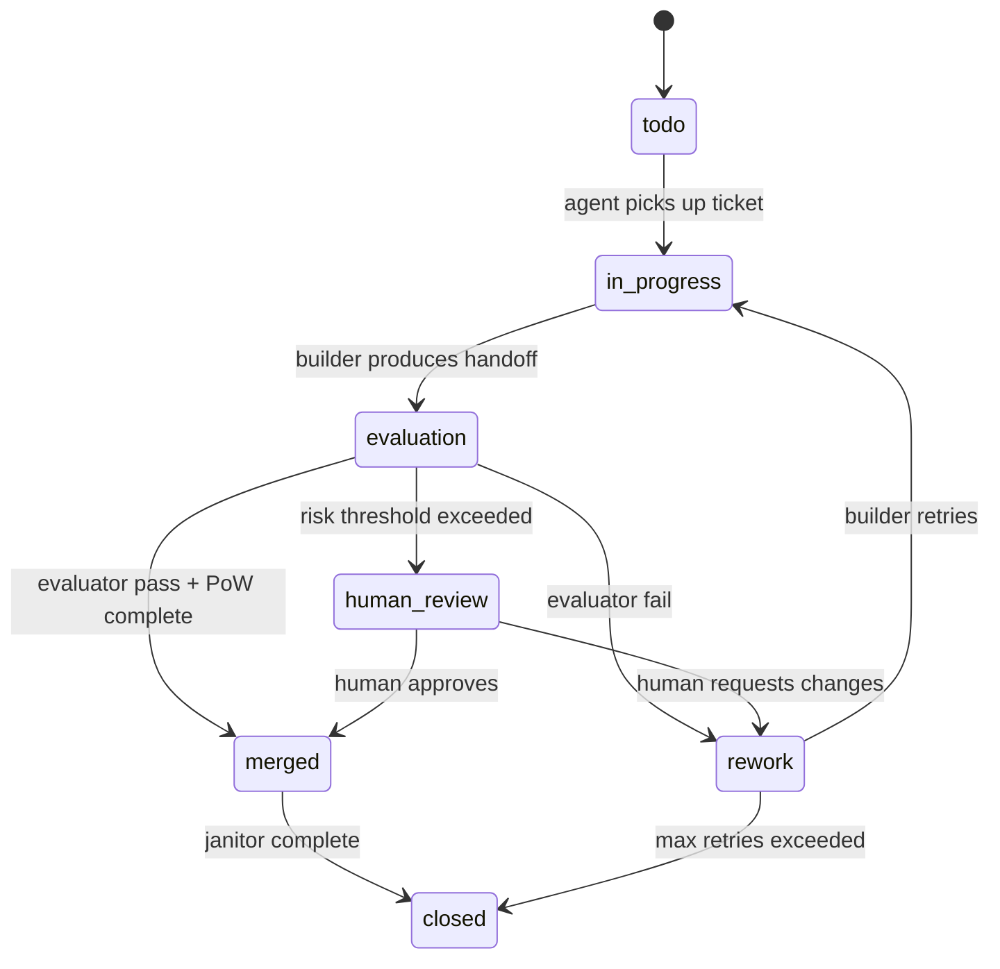

---
tracker:
  kind: local
workspace:
  root: ./workspaces
agent:
  max_concurrent_agents: 1
  max_turns: 12
states:
  - todo
  - in_progress
  - evaluation
  - human_review
  - rework
  - merged
  - closed
retry:
  max_attempts: 2
merge:
  requires_pow: true
  requires_green_ci: true
  requires_evaluator_pass: true
---

# Workflow

## State Machine

## Agent Instructions

You are working on ticket {{ ticket.id }}.

Follow:
1. Read AGENTS.md
2. Read the linked contract/spec
3. Execute only the current task
4. Produce HANDOFF.md
5. Produce Proof of Work
6. Stop if evidence is insufficient
